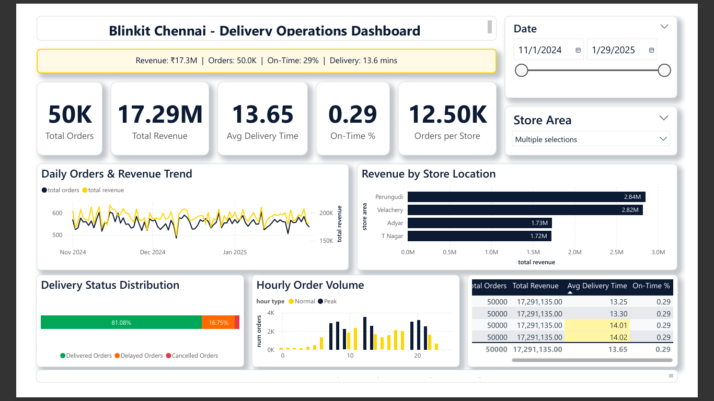

# Blinkit Chennai - Quick Commerce Delivery Optimization

**End-to-end analytics project analyzing 50,000 delivery orders to identify operational bottlenecks in 10-minute delivery operations.**

---

## 📊 Project Overview

Analyzed delivery performance across 12 dark stores in Chennai to optimize quick commerce operations. Used Python for data generation, MySQL for storage, SQL for analysis, and Power BI for visualization.

**Tech Stack:** Python | MySQL | SQL | Power BI | DAX

---

## 🎯 Key Findings

### Delivery Performance
- **45% orders meet 10-minute SLA** (target: 70%+)
- **T Nagar & Velachery average 18+ mins** delivery time
- **Peak hours (7-9 PM) show 2× delivery time** vs morning

### Inventory Issues
- **245 high-demand products out of stock**
- **₹4.8L capital locked in overstocked items**
- **Dairy & vegetables drive 35% of stockouts**

### Revenue Insights
- **Velachery & Perungudi generate 40% of total revenue**
- **Weekend orders 35% higher** than weekdays
- **UPI dominates at 68%** of payment methods

---

## 💡 Business Recommendations

1. **Add 2 dark stores in T Nagar & Adyar** → Reduce delivery time 4-5 mins
2. **Implement predictive inventory** for dairy/vegetables → Reduce stockouts 40%
3. **Increase delivery capacity 7-9 PM** → Improve on-time to 70%+
4. **Liquidate overstocked items** → Reallocate ₹4.8L to high-demand products

---

## 🛠️ Technical Implementation

### Data Generation (Python)
- Synthetic dataset: 50,000 orders, 12 stores, 290 products
- Realistic patterns: peak hours, demand levels, delivery times
- Libraries: pandas, numpy, datetime

### Database Design (MySQL)
- Star schema with 5 tables
- 8 optimized SQL views for analysis
- Proper indexing and foreign key constraints

### SQL Analysis
- 20 business queries covering:
  - Delivery performance metrics
  - Inventory health analysis
  - Revenue trends by store/category
  - Peak hour demand patterns

### Power BI Dashboard
- Single-page executive dashboard (1280×720)
- 9 DAX measures with proper formatting
- 5 relationships (star schema, single direction)
- Conditional formatting on delivery time performance

---

## 📈 Dashboard Preview

**Interactive Features:**
- Date range filtering (Nov 2024 - Jan 2025)
- Store-level drill-down
- Cross-filtering between visuals
